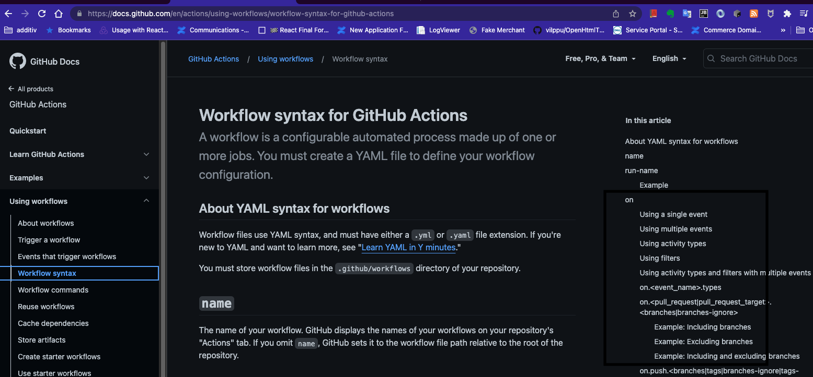

# [](https://)04. Workflows & Events

- Documentatie events [aici](https://docs.github.com/en/actions/using-workflows/events-that-trigger-workflows)

## Event filters & Activity Types

- Activity Types

Ex: pull_request event has opened, closed, edited Activity Types

- Filters

Ex: push gas filter based on target branch

### Activity types

Ex:

```yaml
name: Events Demo 1
on:
  pull_request:
    types: [opened, edited]
  workflow_dispatch:
```

### Event Filters



Ex: Filtrul **branches**

```yaml
name: Events Demo 1
on:
  push:
    branches:
      - main # main
      - 'dev-*' # dev-new dev-this-is-new
      - 'feat/**' # feat/new feat/new/button
```

Obs: ** inseamna orice caracter, inclusiv /. * inseamna orice caracter, mai putin /

Alt filtru este: **paths**, aplicabil pt. evenimentele push, pull_request si pull_request_target.

> When using the push and pull_request events, you can configure a workflow to run based on what file paths are changed. Path filters are not evaluated for pushes of tags.

Ex:

```yaml
name: Events Demo 1
on:
  push:
    branches:
      - main
    paths-ignore:
      - '.github/workflows/*'
```
### Skip workflows

Un commit care ar genera un workflow, poate fi setat ca sa nu genereze workflow-ul, daca in comentariu se adauga "[skip ci]" etc.

[Vezi](https://docs.github.com/en/actions/managing-workflow-runs/skipping-workflow-runs)
